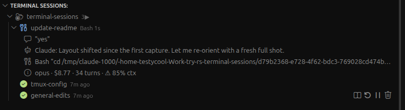

# Terminal Sessions

[](https://marketplace.visualstudio.com/items?itemName=visul.terminal-sessions)
[](https://open-vsx.org/extension/visul/terminal-sessions)
[](LICENSE)

**Install:** [VS Code Marketplace](https://marketplace.visualstudio.com/items?itemName=visul.terminal-sessions) for VS Code, or [Open VSX](https://open-vsx.org/extension/visul/terminal-sessions) for Cursor, Windsurf, and other editors that use the Open VSX registry. Both are on the same version. See [Install](#install) for VSIX and build-from-source.

Persistent terminal sessions for Cursor and VS Code, with first-class awareness of your AI coding agents — **Claude Code, Codex, Antigravity (`agy`), and Grok (xAI)**. Terminals survive full editor restart, organized per workspace, and the sidebar shows live agent state: working/tool/waiting, context usage, cost, last user and assistant messages. Browse, read, name, resume, and clean up every past conversation on your machine, across all four agents.

Every terminal is wrapped in a tmux session whose server runs independent of the editor. Quit Cursor, reboot the window, crash the renderer: Claude Code, dev servers, REPLs, migrations, SSH sessions keep running. Reopen the workspace and everything is where you left it.

**Contents:** [What it looks like](#what-it-looks-like) · [Platform support](#platform-support) · [Why](#why) · [How it works](#how-it-works) · [Features](#features) · [Requirements](#requirements) · [Install](#install) · [First-time setup](#first-time-setup) · [Commands](#commands) · [Keyboard](#keyboard-tmux-prefix-ctrla) · [Settings](#settings) · [Session naming](#session-naming-scheme) · [Recovering without the extension](#recovering-without-the-extension) · [Claude Code rendering in tmux](#claude-code-rendering-in-tmux)

## What it looks like



Sessions are grouped by workspace. The live one shows what the agent is doing right now (running a Bash tool here), the last thing you said, the last thing it replied, the tool it's on with its input, and the model, running cost, turn count, and context use with a warning past 80%. Stopped sessions keep their row and their buttons, so you can view the conversation, restart, or kill them.

## Platform support

| Platform | tmux backend | Notifications | Click-to-focus on notif | Status |
|---|---|---|---|---|
| **macOS (local)** | Native | macOS Notification Center + modal alert | Yes (osascript / terminal-notifier) | Full support |
| **Linux (local)** | Native | `notify-send` (libnotify) + optional `zenity` modal | Yes (zenity) | Full support |
| **Remote-SSH / Remote-WSL** | Native (tmux on the remote) | IPC-forwarded VS Code toast or modal in the local Cursor window | Yes (via VS Code API) | Full support |
| **Windows (native)** | Not supported — needs WSL or Remote-SSH | Falls back to VS Code toast | No | Requires WSL or SSH |

> **Windows users:** tmux does not run natively on Windows. The extension works normally on:
> - **WSL** — install the extension in the WSL-Remote window, install tmux in WSL (`sudo apt install tmux`)
> - **Remote-SSH** — connect to a Linux/macOS host, install the extension on the remote side
>
> Native Windows (PowerShell, cmd, Git Bash) is not supported.

> **Remote-SSH / Remote-WSL users:** you do NOT need to install `terminal-notifier` or `libnotify` on the remote machine. The extension detects the remote extension host via `vscode.env.remoteName` and routes notifications through the VS Code API, which forwards them to your local Cursor UI automatically. The `Show terminal` button on waiting alerts still works across the IPC bridge.

## Why

VS Code's built-in `terminal.integrated.persistentSessionReviveProcess` only survives window reloads, not full app quits. Child processes always die when the editor fully restarts. This extension solves it by wrapping each terminal in a tmux session whose server daemon is independent of the editor process.

## How it works

Three moving pieces, each independent, composed to give you a persistent and observable terminal layer.

**1. tmux as the process keeper.** Every persistent terminal you open is actually `tmux attach-session` against a named session on a tmux server that runs outside of Cursor. Quit Cursor, reboot the window, crash the renderer: the shells and anything they spawned (Claude Code, `npm run dev`, a migration, a long SSH) keep running in the tmux server. When you reopen the workspace, the extension offers to re-attach. Sessions are named `ts-<workspace-hash>-<tabId>`, so two projects or two git worktrees of the same repo never collide.

**2. A managed `~/.terminal-sessions/tmux.conf`.** The extension writes its own tmux config with defaults tuned for Cursor: mouse on, large scrollback, OSC 52 clipboard, modern CSI-u keys, DECSET 2026 synchronized output, and the `CLAUDE_CODE_NO_FLICKER` and `CLAUDE_CODE_DISABLE_MOUSE_CLICKS` env vars baked in so Claude Code renders cleanly in alt-screen and trackpad scroll stays inside the conversation view. Your own `~/.tmux.conf` is never touched; the managed file loads it at the end if it exists, so your personal theme or keybindings still apply.

**3. AI-agent awareness via hooks + transcript tailing.** If you opt in, the extension installs lifecycle hooks for each agent you use — `SessionStart | UserPromptSubmit | PreToolUse | PostToolUse | Notification | Stop | SessionEnd` for Claude (`~/.claude/settings.json`), the equivalent events for Codex (`~/.codex/hooks.json`) and Antigravity (`~/.gemini/antigravity-cli/settings.json`, plus a `statusLine` for live context). A single shared forwarder normalizes each agent's differing event payload and writes a JSON line to `~/.terminal-sessions/agent-events.log`, tagged with the agent id and the tmux session the agent is running in. A file watcher feeds those events into an in-memory map and sets the per-session state (working, tool, waiting, idle). In parallel, a transcript tailer follows the agent's on-disk conversation file and, through that agent's provider, extracts model, token counts, context-window usage, and cost. The sidebar reads both streams and renders the merged snapshot. A conversation can only belong to one tmux session at a time; starting the same conversation in a different tab transfers ownership so the sidebar never shows duplicate live states. Everything below works the same way for Claude, Codex, Antigravity, and Grok — Claude is simply the most battle-tested provider. Grok is the exception on the hook side: it needs none, because the extension discovers its sessions from `~/.grok/active_sessions.json` instead (see [Multi-agent support](#multi-agent-support-claude--codex--antigravity--grok)).

**What persists across what**

| Event | tmux session | Shell process | Agent process | Conversation (`.jsonl`) |
| --- | --- | --- | --- | --- |
| Close a tab | kept | kept | kept | kept |
| Reload window (`Cmd+R` / `Ctrl+R`) | kept | kept | kept | kept |
| Quit Cursor (`Cmd+Q` / `Ctrl+Q`) | kept | kept | kept | kept |
| Restart Session command | killed | killed | killed | kept (auto-resumed) |
| Kill Session | killed | killed | killed | kept — entry moves to the **Killed Sessions** graveyard; *Restore Session* brings it back |
| Machine reboot | killed | killed | killed | kept (recreate from index) |

## Features

### Session lifecycle
- **Persistent sessions** across full editor quit/restart via tmux
- **Workspace-scoped naming** — each project gets its own namespace (8-char path hash), no cross-project collisions
- **Git-worktree aware** — different paths = different hashes, so worktrees automatically get separate sessions
- **Auto-resume toast** on workspace open — "Found N sessions from last time — [Resume All / Pick... / Ignore]"
- **Configurable auto-restore** — `auto` resumes all, `ask` prompts, `off` disables
- **Max age filter** — skip auto-restore for sessions older than N hours (default 72h)
- **Safe tab close** — closing a terminal tab detaches; session keeps running in the background
- **Explicit kill** via command palette, right-click on sidebar item, or "Kill all for this workspace"
- **Auto-prune** stale sessions after configurable days (default 14)
- **Reboot-safe rows** — sessions that were running when the machine shut down reappear as stopped rows after restart (with their conversation history), even if you skip the restore offer; nothing silently vanishes
- **Lock a session against Kill** — right-click → **Lock (Protect from Kill)**; a padlock takes the Kill button's place and the session can no longer be killed — not from the row, not by "Kill all for this workspace", not by auto-prune — until you right-click → **Unlock (Allow Kill)**. The inline padlock is a deliberate indicator only (clicking it won't unlock), so an important long-runner survives an accidental click. Restart and Stop stay available

### UI integration
- **Terminal Profile "Persistent Session"** — available in the `+ ∨` dropdown; can be set as default so every new terminal auto-wraps in tmux
- **Sidebar tree view** — grouped by workspace, with status indicators (attached vs detached) and relative timestamps. Lives **under the Explorer** by default; drag it (or right-click its header → *Move View*) to your own Activity Bar icon, the panel, or the secondary sidebar
- **Rich hover tooltip** — hovering a session row shows its tmux ID, workspace, the actual **start folder (cwd)** for subfolder sessions, created/last-attached times, and — while an agent is active — the live **Conversation ID**, model, API-equivalent cost, context %, token totals, and the last user/assistant messages
- **Sidebar badge** — a red numeric badge appears on the view's host icon (the Explorer, or wherever you've placed the view) when Claude sessions need attention. `waiting` count takes priority (user permission pending), falls back to `working` count. Tooltip explains which is which
- **Click terminal tab → reveal sidebar session** — clicking any `Terminal Sessions #N` tab in the VS Code terminal panel selects and highlights the matching row in the Terminal Sessions sidebar, auto-expanding its workspace group
- **Status bar badge** — `⚡ ts: 2▶ 4⇄` (attached · detached), click to open the attach picker
- **View conversation** — open the session's agent transcript as readable Markdown; reads the transcript `.jsonl` directly, so it works on stopped sessions too (not just live ones) and shows the real conversation regardless of renderer
- **Rename sessions** with custom labels (persisted in index)
- **Custom icon & color per session** — pick from codicons (robot, rocket, flame, database, server, bug, etc.) and ANSI colors; applied to the terminal tab icon and sidebar
- **Restart session** (with agent auto-resume) — kill the current tmux session (any program in it, incl. Claude Code) and respawn a fresh shell; keeps the label, icon, color, and workspace. If Claude was running, the extension auto-detects its session ID, verifies the transcript is still on disk, and runs `claude --resume <id>` in the new shell. Conversation context survives, Ink renderer state is clean
- **Smart click behavior** — clicking a session that's already attached focuses its existing terminal tab instead of opening a duplicate
- **Right-click context menu** on sidebar items — View Conversation, Restart, Stop/Start, Rename, Icon, Color, Mute notifications, Lock/Unlock, Kill
- **Explorer right-click → "Open in Integrated Terminal - Persistent"** — on any folder, opens a persistent tmux session rooted at that folder. The VS Code tab description reflects the actual folder name, not the workspace root

### Sidebar sort modes
- **Custom** — drag sessions in the sidebar to rearrange; order persisted across restarts (stored per-session in `~/.terminal-sessions/index.json`)
- **Recently used** — most recently focused session floats to top
- **Creation order** — oldest first (default, backward-compatible)
- **Alphabetical** — by session label
- Toggle via the `$(list-ordered)` icon in the sidebar title bar; dragging automatically switches to Custom

### Recent & Killed sessions (pinned folders)
- **Recent Sessions** — a pinned virtual folder at the top of each workspace with a flat, group-free list of sessions ordered by recency: running ones first (most recently active on top), then stopped ones by when they were stopped. Rows are ordinary session rows — every action (Start, Restart, View Conversation, …) works — and mirror the sessions in their groups below, so it's a shortcut, not a move. Capped at 50 (`terminalSessions.activityLimit`)
- **Killed Sessions** — killing a session no longer deletes it: the entry (label, folder, resume flags, full conversation history) moves into a per-workspace graveyard, so Kill is reversible. Right-click a killed row → **Restore Session** recreates it under a fresh tab id and resumes its conversation. Also available from the Command Palette — the only way back when a workspace's last session was killed. Keeps the most recent 50 kills (`terminalSessions.killedLimit`); entries with nothing restorable (no label, no conversation) aren't kept, and the folder hides while empty
- **Enable/Disable per folder** — via the view's `⋯` menu (exactly one of Enable/Disable shows, tracking the current state), right-click on the folder row, or the `showActivityFolder` / `showKilledFolder` settings. Both default to on

### YOLO mode switch (auto-approve)
- **Switch to YOLO Mode / Switch to Normal Mode** — right-click a session to relaunch its agent with (or without) auto-approve flags, continuing the **same conversation**: `--dangerously-skip-permissions` for Claude, `--yolo` for Codex/Antigravity, the equivalent for Grok. The flag set is per-agent and allowlisted, so nothing else about the launch command changes
- **🚨 chip** — sessions running in YOLO mode show a 🚨 in their sidebar description (stopped sessions too, meaning "will start in YOLO mode"); the tooltip names the actual flags
- **Confirmation prompt** before switching into YOLO (`terminalSessions.confirmYoloSwitch`, default on)

### Filter, groups & navigation
- **Filter modes** — show `all`, only `running`, or only `stopped` sessions via the `$(filter)` icon in the title bar (`terminalSessions.sidebarFilterMode`)
- **Stop / Start a session** — pause a session (kills the tmux session but keeps the row, with its label, icon, color, and agent history) and start it again later, instead of killing it outright. Stopped rows get an inline `$(play)`
- **Groups & master groups** — organize sessions under named groups, and groups under master groups, via right-click `New Group…` / `New Master Group…` / `Move to Group…`, with drag-and-drop and per-group rename/delete. Purely organizational; the underlying tmux sessions are untouched
- **Re-attach All Ghost Terminals** — one click (`$(debug-restart)` in the title bar) revives the orange/disconnected tabs you get after a Cursor restart, in sidebar order
- **Reveal Session Folder** — right-click → open the session's working directory in the OS file manager (Finder/Explorer), or jump to its row from the terminal tab via `Reveal in Terminal Sessions View`
- **Copy Last Conversation ID / Path** — right-click → put the most recent agent conversation's UUID, or the full path to its transcript `.jsonl`, on the clipboard (resolves through whichever agent the session is running, so it works for all four)

### Forking conversations (Claude)

- **Fork Conversation** — right-click a Claude session → **Fork Conversation (new parallel branch)** to open a new session/tab that continues the same conversation on its own independent branch. Runs `claude --resume <id> --fork-session`, which mints a fresh conversation id, so the two sessions never share a transcript and neither can overwrite the other. You can name the branch; it defaults to `fork N`
- **Fork clusters** — the origin and its forks gather under one collapsible header with a `repo-forked` icon tinted in the branch set's color, labeled `{origin} · N forks`. Separate from your normal folder groups, expanded by default, and the collapse state sticks. A lone or filtered member outside a cluster keeps the small `⑂` chip instead
- **Unlink from Branch Set** — right-click a linked session → **Unlink from Branch Set** to make it standalone again. Only the visual link goes away; the conversations were already independent from the moment of the fork, so nothing is lost. A set dissolves automatically once it drops below two members, including when you kill one side
- **Claude only** — the command is hidden on Codex, Antigravity, and Grok sessions, which have no fork equivalent. It is also sidebar-only, because VS Code cannot gate the native terminal-tab menu per agent

### Subagents in the sidebar
- **`🤖 Agents (N running · M done)` folder per session** — one collapsible row groups every subagent a Claude session spawned, so sessions with lots of agents stay tidy. Auto-expanded while anything is live; collapsed when everything finishes. Tooltip previews the first five agents with their state
- **Live per-subagent rows** — state icon (spinner / tools / check), elapsed time, current tool with input preview, last streamed message. Nests recursively for agents that spawn sub-subagents
- **Inline subagent counter in the session description** — `Terminal Sessions waiting input · 69% ctx · 🤖 2 running` (falls back to `🤖 N done` after completion). See live agent activity without expanding
- **Agent label** — `<subagent_type> — <description>` pulled from the `Agent` / `Task` tool input (e.g. `researcher — MCP servers for note apps`). Tooltip shows depth, parent agent id, and timestamps
- **Background-agent support** — Claude Code ≥ 2.1.119 spawns subagents via the `Agent` tool with `run_in_background: true`; their activity is written to per-agent transcripts in `<main-jsonl>/subagents/agent-<id>.jsonl` (not as sidechain messages). The tailer scans that sibling directory on a 3-second poll, so live state surfaces within ~3 s even without the main jsonl being written. The classic synchronous `Task` tool path keeps working too
- **`terminalSessions.showCompletedSubagents`** (default `true`) — keeps completed agents visible so short runs don't flicker in and out. Flip to `false` (or run `Terminal Sessions: Toggle Show Completed Subagents`) to focus only on live work
- **`Open Subagent Transcript` command** — right-click a subagent row → opens its transcript jsonl in an editor tab jumped to the first line where that agent was registered. For background agents this is the small per-agent file, much easier to read than the main conversation transcript
- **Auto-done on parent idle** — when the parent session has been idle for 2+ minutes, stragglers flagged `working` are marked done in the rendered snapshot so the sidebar doesn't spin forever on interrupted agents

### Multi-agent support (Claude · Codex · Antigravity · Grok)
- **One sidebar, four agents** — the same live status, context %, cost, history, and auto-resume work for **Claude Code**, **Codex**, **Antigravity** (`agy`), and **Grok** (xAI). Each tracked session shows which agent it's running, so a row reads `Codex working 12s` vs `Claude working 12s`
- **Auto-detection** — Claude is always on; Codex, Antigravity and Grok turn on automatically when their CLI (`codex` / `agy` / `grok`) is found on your `PATH`. Override explicitly with `terminalSessions.enabledAgents` (e.g. `["claude", "codex"]`)
- **Per-agent hooks, one forwarder** — `Terminal Sessions: Install AI Agent Hooks` writes the right hook into each agent's own settings file (`~/.claude/settings.json`, `~/.codex/hooks.json`, `~/.gemini/antigravity-cli/settings.json`); a single shared script normalizes their differing event payloads. Your model and MCP config are never disturbed
- **Grok needs no hooks** — Grok's lifecycle hooks are project-scoped and trust-gated, so the extension tracks it without installing anything: it discovers live Grok sessions from `~/.grok/active_sessions.json`, matches each to its tmux pane by process tree, and tails the session's ACP `updates.jsonl` for status, tokens, and messages. Nothing is written into your projects
- **Agent-correct resume** — restart/resume runs the right command per agent: `claude --resume <id>` (cwd-sensitive), `codex resume <id>` (restores its own recorded cwd), or `agy --conversation <id>`. The extension picks it from the session's recorded agent automatically
- **Provider abstraction** — adding more agents later is a new provider file, no core changes; all four share one tracker, state machine, and notification path

### Live agent status in the sidebar
- **Per-session state indicator** — icon + description reflect whether the agent is `working`, running a `tool` (with tool name), `waiting` for user permission, or `idle` (with time-since). State is derived from the transcript directly so it stays correct even when hooks are out of date
- **API-equivalent cost in USD** — cost per session computed from the transcript against a built-in rate card (hardcoded in `src/claude-pricing.ts`, last verified January 2026 — it does not fetch live prices), per-model (Opus 4.7 at $5/$25 in/out, Opus 4.1 at $15/$75, Sonnet at $3/$15, Haiku at $1/$5, plus separate cache-read and 5-min/1-hour cache-write tiers). Retried turns are de-duplicated by `message.id`; subagents on different models are counted automatically with their own rate. Sidebar shows `opus · $55.25 · 364 turns`; tooltip shows per-model breakdown and the raw token totals
- **Context-window gauge** — the `31% ctx` suffix appears next to every Claude-active session. Crosses `terminalSessions.contextWarnPct` (default 0.8) → `⚠ 87% ctx`. Limit is auto-detected per session: Opus/Sonnet 4.5+ default to 1M-context, older models to 200k; if any single turn exceeds 200k we pin the limit to 1M. Subagent turns are excluded because they have their own context
- **Nested detail rows** — under each active session, rows show last user message, last Claude reply, model/cost/turns, current tool with its input (e.g. `Bash: "npm run build"`); configurable `auto | always | off`
- **Search past sessions** — `$(search)` button in the sidebar (or `Terminal Sessions: Find Session by Prompt…` command) opens a fuzzy picker over every transcript on your machine. Jump to transcript, copy session ID, or reveal the cwd
- **Deduplicated live state** — if you ran `claude --resume <id>` in multiple tabs over time, the tracker now transfers ownership on each new hook event, so only the tab currently running that conversation shows live state. Others snap back to idle

### Archive, conversation viewer & cleanup
- **Resume Session from Archive** — the `$(history)` button on the sidebar toolbar (or `Terminal Sessions: Resume Session from Archive…`) opens a picker of **every** past conversation on disk, across every agent you have enabled, even when nothing is live in tmux for it. Defaults to the current workspace with a one-click toggle to show all projects. Accepting a row resumes it into your active session or a fresh persistent one
- **View Conversation** — right-click a session (or the eye button in the archive picker) to open a readable Markdown rendering of the conversation in VS Code's preview: user and assistant turns, with thinking blocks and tool calls in collapsible sections. No more squinting at raw `.jsonl`
- **Name Conversation** — give any session a friendly name; it shows in the archive picker and the viewer title. Names live in the extension's sidecar index, so the agent's transcript files are never modified
- **Clean Up Empty / Invalid Sessions** — a maintenance action (sidebar overflow `⋯` menu) that finds empty or "Invalid API key" conversations and soft-deletes them into `~/.claude/projects/.bak`, with a preview and confirmation. **Claude only** — Codex, Antigravity, and Grok transcripts are never classified or moved, and the soft-delete refuses any path outside `~/.claude/projects`. The agent's own database and session index are never touched; moved files can be restored manually

### Notifications
- **Claude Stop notification** — fires when Claude finishes a response. Distinct from the waiting variant so you can glance at the sound/icon and know whether you need to act. Min-duration filter prevents notif-storms on short turns
- **Claude Waiting notification** — fires when Claude blocks for user permission (tool approval, risky command, URL access). Distinct sound (default `Sosumi` vs `Glass` for Stop), `⚠ Claude needs approval` title, subtitle is the session label. Two styles via `terminalSessions.waitingAlertStyle`:
  - `banner` — standard macOS/Linux notification, auto-dismisses
  - `alert` — **persistent modal dialog** with a `Show terminal` button that activates Cursor and focuses the matching tab. macOS uses `osascript display alert`; Linux uses `zenity --question` (if installed)
- **Click-to-focus** (macOS) — if `terminal-notifier` is installed (`brew install terminal-notifier`), clicking any notification banner or alert brings Cursor to the foreground instead of Script Editor. Without `terminal-notifier` notifications still work, but click lands in Script Editor — see the Requirements section for the exact trade-off
- **Works over Remote-SSH / Remote-WSL** — when the extension host runs on a remote machine (the tmux session lives on the server, Cursor runs on your laptop), OS native notifications posted from the remote can't reach your desktop. The extension auto-detects this via `vscode.env.remoteName` and routes through the VS Code API instead: waiting events become an IPC-forwarded warning toast (banner style) or a blocking modal dialog (`alert` style) that pops up in your local Cursor window. The `Show terminal` button still works the same way — click it and the extension iterates `vscode.window.terminals` on the remote extension host and focuses the matching tab in your local UI. No extra setup on the remote; libnotify/terminal-notifier are not used in remote mode because they would be useless
- **Global on/off toggle** — bell icon in the Terminal Sessions sidebar title bar toggles `notifyOnClaudeWaiting`. When off, the icon switches to `$(bell-slash)`. Command Palette also has `Terminal Sessions: Toggle Claude Waiting Alerts (Global)`
- **Per-session mute** — right-click a session → `Mute Notifications`. Stop and Waiting notifications for that session are silenced until you unmute. Muted sessions display a `🔕` in the sidebar description. Useful for long-running experiments where you don't want beeps
- **Native macOS Notification Center** — mode-switchable (`auto`: native when Cursor is unfocused / toast when focused; `always`; `never`)
- **Native Linux** — uses `notify-send` with urgency `critical` for warnings (sticky until dismissed on most desktop environments); falls back to VS Code toast if libnotify is missing
- **Sound picker** — 14 macOS built-in sounds (Glass, Ping, Hero, Pop, Sosumi, …). Separate settings for Stop (`notificationSound`) and Waiting (`notificationSoundWaiting`). Linux sound mapping is not implemented; sound is macOS-only
- **Long-running command alerts** — notification when a command takes longer than a configurable threshold (default 30s)
- **Post-reboot recovery** — "Recreate Sessions from Index" rebuilds your sessions after a reboot wiped the tmux server; optional `claude --resume <id>` hint toast so you can reattach Claude Code sessions by ID

### Making macOS notifications persistent

macOS decides whether notifications show as auto-dismissing **banners** or sticky **alerts** at the OS level, not from the app. To make every notification stay on screen until you dismiss it:

1. Open **System Settings → Notifications**
2. Find **Script Editor** (that is the app that posts our notifications via osascript)
3. Change **Notification style** from `Banners` to `Alerts`

Alerts get a `Show` button and stay in the top-right corner until you click it or Close. The `terminalSessions.waitingAlertStyle: "alert"` setting is an alternative that works without changing System Settings — it produces a modal dialog instead of a banner.

### tmux integration (managed config)
The extension generates and manages `~/.terminal-sessions/tmux.conf` with sensible defaults tuned for Cursor. Your default `~/.tmux.conf` is **not** touched — this file only loads when the extension starts a session.

Defaults include:
- **Mouse on**, 50 000 line scrollback, 10ms escape time, focus events, `exit-empty off`
- **True color** support (`tmux-256color` + `xterm-256color:RGB`)
- **OSC 52 clipboard** (`set-clipboard on`) — selections copy to the system clipboard through Cursor automatically
- **DECSET 2026 synchronized output** passthrough (`terminal-features xterm*:sync`) — apps like Claude Code that emit the sequence stop producing flicker through tmux
- **`allow-passthrough on`** — TUIs can send OSC/kitty-graphics/clipboard sequences through unfiltered
- **`extended-keys on`** — modern CSI-u encoding so Ctrl+Shift combos reach Claude Code correctly
- **`CLAUDE_CODE_NO_FLICKER=1`** and **`CLAUDE_CODE_DISABLE_MOUSE_CLICKS=1`** baked in via `set-environment -g` — every new tmux window inherits these, so Claude renders in alt-screen and trackpad scroll stays inside the conversation view. No shell rc edit required
- **Drag-select stays in copy-mode** (tmux default exits copy-mode and jumps to prompt — override uses `copy-selection-no-clear`)
- **Trackpad-friendly scroll** — 1 line per tick (default 5 is too fast on trackpads)
- **Custom prefix `Ctrl+A`** (screen-style). `Ctrl+A Ctrl+A` sends a literal Ctrl+A
- **Menu on `Ctrl+A q`** — copy mode, paste, splits, zoom, rename, kill, respawn, reload config
- **Status bar off** — Cursor has its own UI, saves a row
- **Inherit** `~/.tmux.conf` if present (append your theme/keybinds)

On updates, if the managed file is out of date you get a one-time toast offering to regenerate it. The old file is backed up next to it with a timestamp before any rewrite.

Two commands:
- `Terminal Sessions: Open tmux.conf` — opens the file in an editor
- `Terminal Sessions: Reload tmux Config` — applies changes to all running sessions

### Portability / recovery
- **Remote-SSH support** — runs on whichever side hosts the workspace (remote when connected over SSH, local otherwise). Install on both, the right copy activates per window. One VSIX works both local and remote
- **No lock-in** — everything is plain tmux. If the extension breaks you can `tmux ls` and `tmux attach -t ts-xxx` from any system terminal
- **Index file** at `~/.terminal-sessions/index.json` maps workspace hashes to readable paths and labels (for debugging or external tools)

## Requirements

### Required
- **tmux** on your `PATH`: `brew install tmux` (macOS) or `sudo apt install tmux` (Debian/Ubuntu) or `sudo dnf install tmux` (RHEL/Fedora)
- **Claude Code ≥ 2.1.110** if you want the `CLAUDE_CODE_NO_FLICKER` rendering fix to take effect (earlier versions had a regression that wiped scrollback)

### Optional but recommended (for best notification UX)

The extension works out of the box, but the click-to-focus behavior on notifications depends on small platform helpers. Without them, you still get the notification — you just can't click it to jump straight to the right terminal tab.

**macOS**
- `brew install terminal-notifier` — makes **click on a `Claude done` / `Claude needs approval` banner focus Cursor** instead of bouncing you to Script Editor. Without it, notifications still show up, but they are posted via `osascript` which attributes them to Script Editor.app; clicking "Show" opens Script Editor, not the IDE. With it, the extension uses `terminal-notifier -activate <Cursor bundle id>` so clicks land in Cursor.
- For fully persistent banners that stay on screen until you dismiss them: System Settings → Notifications → Script Editor (or Terminal Notifier, if you installed it) → set Notification style to **Alerts** instead of Banners. Alternatively keep banners and flip `terminalSessions.waitingAlertStyle` to `"alert"` so waiting events come through as a modal dialog (persistent and click-to-focus, macOS-only).

**Linux**
- `libnotify` — required for any native notification at all:
  `sudo apt install libnotify-bin` (Debian/Ubuntu) or `sudo dnf install libnotify` (RHEL/Fedora). Without it, the extension falls back to VS Code toasts (in-editor popups, auto-dismissing).
- `zenity` (optional) — enables the persistent modal dialog for waiting alerts (`waitingAlertStyle: "alert"`). Without it, the `alert` style silently falls back to a sticky `notify-send -u critical` banner. Install with `sudo apt install zenity` or `sudo dnf install zenity`.

### Build from source (only if contributing)
- **Node.js 20+**

### Summary: what's installed vs what you get

| Platform | Package | Without it | With it |
|---|---|---|---|
| macOS | `terminal-notifier` | Notifications appear but clicking them opens Script Editor | Notifications appear and clicks focus Cursor |
| macOS | Notification style = Alerts (System Settings) | Banners auto-dismiss in 5s | Banners stay until dismissed, have `Show` button |
| Linux | `libnotify-bin` | Notifications fall back to VS Code toasts | Native desktop notifications via `notify-send` |
| Linux | `zenity` | `waitingAlertStyle: "alert"` falls back to sticky banner | Real modal dialog with `Show terminal` button |

## Install

### From a marketplace (recommended)

- **VS Code** — [marketplace.visualstudio.com](https://marketplace.visualstudio.com/items?itemName=visul.terminal-sessions), or search `Terminal Sessions` in the Extensions panel
- **Cursor, Windsurf, VSCodium** — [open-vsx.org](https://open-vsx.org/extension/visul/terminal-sessions), which is the registry those editors use. Searching `Terminal Sessions` in the Extensions panel finds it

Or from the command line:
```bash
code --install-extension visul.terminal-sessions      # VS Code
cursor --install-extension visul.terminal-sessions    # Cursor
```

### From VSIX
```bash
cursor --install-extension terminal-sessions-0.20.29.vsix --force
```
Or in Cursor: Extensions panel → `⋯` → **Install from VSIX...**

### From source (development)
```bash
cd path/to/terminal-sessions
npm install
npm run compile
# Press F5 in Cursor to launch an Extension Development Host
```

### Build your own VSIX
```bash
npm install
npm run package   # produces terminal-sessions-<ver>.vsix
```

### On SSH Remote
The extension runs on the workspace side (remote when connected over SSH, local otherwise). Install it on both so the right copy picks up per window.

1. Install tmux on the remote server
2. In a Remote-SSH window: Cmd+Shift+P → "Extensions: Install from VSIX..." → pick your local `.vsix`. Cursor uploads and installs on the remote automatically
3. Reload the remote window. Sidebar and commands operate against the remote tmux

### On WSL
1. In a WSL-Remote window, open a workspace under `\\wsl$\...`
2. Install tmux in WSL: `sudo apt install tmux`
3. Install the extension in the WSL-Remote extension host (same VSIX flow as above)
4. Reload

## First-time setup

1. Install tmux on the target machine
2. Install the extension and reload Cursor (full quit + reopen if you see stale state)
3. Run `Terminal Sessions: Set as Default Terminal Profile` so every `+` button creates a tmux-wrapped terminal
4. Find the **Terminal Sessions** section under the Explorer (or drag it out to its own Activity Bar icon / the panel — VS Code remembers where you put it)
5. Optional: run `Terminal Sessions: Install AI Agent Hooks` to enable live agent state + notifications for Claude, Codex, and Antigravity

## Commands

| Command | What it does |
|---|---|
| `Terminal Sessions: New Persistent Terminal` | Creates a new tmux-wrapped terminal for the current workspace |
| `Terminal Sessions: Attach to Session...` | Quick-pick across all sessions (any workspace) |
| `Terminal Sessions: Resume All For Workspace` | Open terminals for every detached session of the current project |
| `Terminal Sessions: Reveal Sidebar` | Focus the sidebar tree view |
| `Terminal Sessions: Kill Session` | Pick a session to kill |
| `Terminal Sessions: Kill All Sessions for This Workspace` | Clean up this project |
| `Terminal Sessions: Kill All Stale Sessions` | Prune sessions older than `pruneAfterDays` |
| `Terminal Sessions: Find Session by Prompt...` | Fuzzy picker over every Claude transcript on your machine |
| `Terminal Sessions: Set as Default Terminal Profile` | Write the VS Code setting so `+` auto-wraps |
| `Terminal Sessions: Open tmux.conf` | Edit `~/.terminal-sessions/tmux.conf` |
| `Terminal Sessions: Reload tmux Config` | Apply config changes to running sessions |
| `Terminal Sessions: Install AI Agent Hooks` | Writes lifecycle hooks for each enabled agent into its own settings file (Claude `~/.claude/settings.json`, Codex `~/.codex/hooks.json`, Antigravity `~/.gemini/antigravity-cli/settings.json`) |
| `Terminal Sessions: Uninstall AI Agent Hooks` | Removes the hooks for all agents |
| `Terminal Sessions: Resume Session from Archive...` | Picker over every past conversation on disk (Claude/Codex/Antigravity); resume, view, or name any of them |
| `Terminal Sessions: Resume Other Session...` | Resume a different past conversation into the current session (cross-agent) |
| `Terminal Sessions: Change Sidebar Filter` | Show all / running-only / stopped-only sessions |
| `Terminal Sessions: Change Sidebar Sort` | Pick custom / recently-used / creation-order / alphabetical |
| `Terminal Sessions: New Master Group...` | Create a master group to hold other groups |
| `Terminal Sessions: Test Native Notification` | Fire a sample notification to check your OS setup |
| `Terminal Sessions: Fix Claude Code Rendering in Shell` | Appends `CLAUDE_CODE_NO_FLICKER=1` and `CLAUDE_CODE_DISABLE_MOUSE_CLICKS=1` to your rc file (optional — the managed tmux.conf already bakes these in, so most users won't need this) |
| `Terminal Sessions: Toggle Claude Waiting Alerts (Global)` | Flip the `notifyOnClaudeWaiting` setting |
| `Terminal Sessions: Recreate Sessions from Index` | After a reboot, rebuild tmux sessions from the stored index |
| Right-click on sidebar session → `Restart` | Kill + fresh shell; auto-resume the agent if detected |
| Right-click on sidebar session → `View Conversation` | Render the session's transcript as Markdown (reads the `.jsonl` directly — works on stopped sessions too) |
| Right-click on sidebar session → `Name Conversation...` | Give the session a friendly name (shown in the archive picker) |
| Right-click on sidebar session → `Stop` / `Start` | Pause/respawn the tmux session while keeping the sidebar row |
| Right-click on sidebar session → `Switch to YOLO Mode` / `Switch to Normal Mode` | Relaunch the same conversation with (or without) the agent's auto-approve flags; 🚨 chip marks YOLO sessions |
| Right-click on killed row (or Command Palette) → `Restore Session` | Bring a killed session back from the graveyard and resume its conversation |
| View `⋯` menu / folder right-click → `Enable/Disable Recent Sessions Folder`, `Enable/Disable Killed Sessions Folder` | Toggle the two pinned virtual folders |
| Right-click on sidebar session → `Copy Last Conversation ID` / `Copy Last Conversation Path` | Clipboard the agent conversation's UUID or the full path to its transcript `.jsonl` |
| Right-click on sidebar session → `Reveal Session Folder` | Open the session's working directory in Finder/Explorer |
| Right-click on sidebar session → `Fork Conversation (new parallel branch)` | Continue the same Claude conversation on an independent branch in a new session |
| Right-click on sidebar session → `Unlink from Branch Set` | Drop the fork link and make the session standalone again |
| Right-click on workspace/group → `New Group…` / `Move to Group…` / `Move to Master Group…` | Organize sessions into groups and master groups |
| Right-click on group → `Rename Group` / `Delete Group` / `Change Group Color…` | Edit an existing group |
| Sidebar title bar → `Collapse Sessions` | Collapse every expanded row in the tree |
| Sidebar overflow `⋯` → `Clean Up Empty / Invalid Sessions...` | Soft-delete empty/invalid conversations to `~/.claude/projects/.bak` |
| Right-click on sidebar session → `Rename` | Set a friendly label |
| Right-click on sidebar session → `Change Icon` / `Change Color` | Pick custom icon or theme color |
| Right-click on sidebar session → `Mute Notifications` / `Unmute Notifications` | Per-session silencing |
| Right-click on sidebar session → `Lock (Protect from Kill)` / `Unlock (Allow Kill)` | Protect a session from Kill (padlock takes the Kill slot); Unlock to allow killing again |
| Right-click on sidebar session → `Kill` | Terminate that session (hidden while the session is locked) |
| Right-click on folder in Explorer → `Open in Integrated Terminal - Persistent` | New tmux session rooted at that folder |

## Keyboard (tmux prefix `Ctrl+A`)

| Key | Action |
|---|---|
| `Ctrl+A q` | Menu: copy mode, paste, splits, zoom, rename, kill, respawn, reload config |
| `Ctrl+A Ctrl+A` | Send a literal `Ctrl+A` (for shell "beginning of line") |
| Mouse drag-select | Copy to clipboard, stay in copy-mode |
| Mouse wheel in pane | Enter copy-mode, scroll 1 line/tick |
| `q` or `Esc` or `Enter` | Exit copy-mode |
| Right-click | Cursor context menu (Copy/Paste/Kill Terminal/etc.) |

## Settings

| Setting | Default | Description |
|---|---|---|
| `terminalSessions.tmuxPath` | `""` | Absolute path to tmux binary. Empty = autodetect from PATH and common locations |
| `terminalSessions.sessionPrefix` | `"ts"` | Prefix for session names, e.g. `ts-a3f2c71d-1` |
| `terminalSessions.enabledAgents` | `[]` (auto-detect) | Which AI CLIs to track. Empty = Claude always on, Codex/Antigravity/Grok on when found on PATH. Accepts `claude`, `codex`, `agy`, `grok`. Override e.g. `["claude","codex"]` |
| `terminalSessions.autoRestore` | `"ask"` | On workspace open: `auto`, `ask`, or `off` |
| `terminalSessions.autoRestoreMaxAgeHours` | `72` | Skip auto-restore for sessions older than this |
| `terminalSessions.pruneAfterDays` | `14` | Offer to prune sessions idle longer than this (`0` to disable) |
| `terminalSessions.sidebarSortMode` | `"created"` | `custom`, `mru`, `created`, or `alphabetical` |
| `terminalSessions.sidebarFilterMode` | `"all"` | Filter sidebar by state: `all`, `running`, or `stopped` |
| `terminalSessions.showActivityFolder` | `true` | Show the pinned **Recent Sessions** folder (flat recency list) at the top of each workspace |
| `terminalSessions.showKilledFolder` | `true` | Show the pinned **Killed Sessions** folder (graveyard with Restore); hidden while empty |
| `terminalSessions.activityLimit` | `50` | Max sessions listed in Recent Sessions |
| `terminalSessions.killedLimit` | `50` | Max killed sessions kept in the graveyard (older entries fall off) |
| `terminalSessions.confirmYoloSwitch` | `true` | Ask for confirmation before switching a session into YOLO (auto-approve) mode |
| `terminalSessions.revealActiveSession` | `true` | Focusing a terminal selects its matching sidebar row. Only ever selects an already-visible row (never expands a collapsed group or scrolls to a hidden one). Set `false` to stop the selection following your active tab |
| `terminalSessions.claudeSidebarDetails` | `"auto"` | Expand the nested rows under a Claude session: `auto`/`always`/`collapsed`/`off` |
| `terminalSessions.claudeNoFlicker` | `"auto"` | `CLAUDE_CODE_NO_FLICKER` mode. `auto` = off on Cursor (conversation copyable), on in VS Code (clean alt-screen). `on` = always clean, no copy from live view. `off` = always copyable, slight flicker |
| `terminalSessions.contextWarnPct` | `0.8` | Threshold (0-1) for the `⚠ 87% ctx` warning next to Claude state |
| `terminalSessions.nativeNotifications` | `"auto"` | `auto` (native when Cursor unfocused), `always`, `never` |
| `terminalSessions.notificationSound` | `"Glass"` | macOS sound for Claude Stop notifications |
| `terminalSessions.notificationSoundWaiting` | `"Sosumi"` | macOS sound for Claude Waiting notifications (distinct from Stop) |
| `terminalSessions.notifyOnClaudeStop` | `true` | Send a notification when Claude finishes a response |
| `terminalSessions.notifyOnClaudeWaiting` | `true` | Send a notification when Claude blocks for user permission |
| `terminalSessions.waitingAlertStyle` | `"banner"` | `banner` (auto-dismiss) or `alert` (persistent modal dialog with Show button) |
| `terminalSessions.claudeStopMinDurationSeconds` | `15` | Skip Stop notifications for turns shorter than this |
| `terminalSessions.autoResumeClaude` | `false` | After recreating sessions post-reboot, auto-run `claude --resume` |
| `terminalSessions.enableLongRunNotifications` | `true` | Notify when a command takes >N seconds |
| `terminalSessions.longRunThresholdSeconds` | `30` | Threshold for long-run notifications |

## Session naming scheme

```
{prefix}-{8-char SHA-256 hash of workspace path}-{tab number}
```

Example: `ts-a3f2c71d-1` is the first persistent terminal opened in whatever workspace hashes to `a3f2c71d`. The index at `~/.terminal-sessions/index.json` maps hashes to human-readable paths and labels.

Git worktrees automatically get separate namespaces (different absolute paths → different hashes).

## Recovering without the extension

Plain tmux under the hood:
```bash
tmux ls                         # list all sessions on the default socket
tmux attach -t ts-a3f2c71d-1    # attach from any system terminal
tmux kill-session -t ts-...     # kill from CLI if extension won't
```

## Claude Code rendering in tmux

Claude Code's TUI writes full-frame redraws into the main terminal buffer on every state change, which tmux faithfully captures, producing scrambled scrollback, duplicate prompts, and corruption after detach/reattach or during heavy subagent use. This is a Claude-Code-side issue (Ink/React renderer), not tmux. See `anthropics/claude-code#29937`, `#41814`, `#46981`.

### Fix (automatic)

The managed `~/.terminal-sessions/tmux.conf` now emits
```tmux
set-environment -g CLAUDE_CODE_NO_FLICKER 1
set-environment -g CLAUDE_CODE_DISABLE_MOUSE_CLICKS 1
```
so every new tmux window inherits these at startup. No shell rc edit needed. The extension auto-prompts to regenerate older configs on upgrade.

- **`CLAUDE_CODE_NO_FLICKER=1`** — Claude Code renders into the alternate screen buffer (like `vim`, `less`, `htop`). tmux no longer captures each intermediate frame, so scrollback stays clean across detach/reattach and parallel subagents
- **`CLAUDE_CODE_DISABLE_MOUSE_CLICKS=1`** — clicks are handed to tmux (so you can still click-select panes, tabs, the sidebar, etc.) but scroll events still reach Claude Code. Trackpad scrolls Claude's conversation view directly. `DISABLE_MOUSE=1` alone would block trackpad scroll

Requires Claude Code ≥ 2.1.110 (earlier versions had a regression that wiped scrollback).

**Default is editor-aware (`terminalSessions.claudeNoFlicker: auto`):** on **Cursor**, NO_FLICKER is **off** by default — Claude uses the classic renderer so the conversation lands in tmux scrollback and copies cleanly via pbcopy/xclip (Cursor mis-decodes Claude's own OSC 52 copy, so this is the only way to copy accented text). On **VS Code** it stays **on** (clean alt-screen; VS Code copies OSC 52 fine, so nothing is lost). Force it either way with `on` (always clean, but no copy from the live Claude view) or `off` (always copyable, at the cost of a little flicker on heavy redraws). Changing it regenerates and reloads tmux.conf; restart the Claude session to apply.

If you started Claude in a session before the v3 config was applied, the env vars aren't in that shell yet. Either run `Restart Session` on the sidebar (auto-resumes the conversation) or `exec bash` / `exec zsh` inside the pane to pick them up.

### Copy / paste workflow

- **From plain shell output (git, build logs, bash):** drag-select with the trackpad as usual. Selection copies to the system clipboard via OSC 52
- **From the Claude conversation:** press `Ctrl+O` then `[` inside Claude. That dumps the current conversation view into the main tmux scrollback. From there, drag-select normally. Press `Ctrl+O` then `/` for Claude's own in-view search
- **Cmd+F / tmux copy-mode search** only sees content in the main buffer. The live Claude view lives in alt-screen, so it is not searchable that way — use `Ctrl+O` `/` inside Claude instead
- **Over Remote-SSH:** an agent's own copy (Claude/Codex "copied to clipboard") reaches your **local** machine's clipboard with correct UTF-8, accents included. A headless remote has no clipboard tool (`xclip`/`pbcopy` fail) and Cursor's terminal mis-decodes OSC 52 for non-ASCII, so the extension installs a tiny writer on the remote and bridges what it captures to the local clipboard through the VS Code API. No setup on the remote

## Changelog

See [CHANGELOG.md](CHANGELOG.md).

## License

MIT
